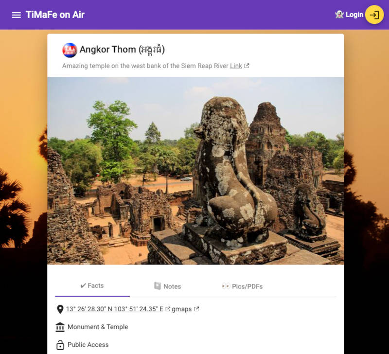
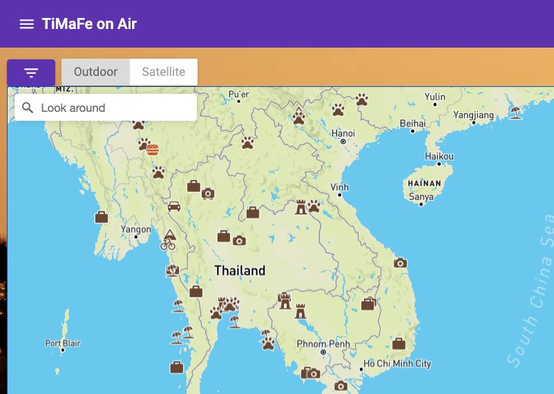

image:https://img.shields.io/badge/angular-%23DD0031.svg?style=for-the-badge&logo=angular&logoColor=white[Angular]
image:https://img.shields.io/badge/kotlin-%230095D5.svg?style=for-the-badge&logo=kotlin&logoColor=white[Kotlin]
image:https://img.shields.io/badge/spring-%236DB33F.svg?style=for-the-badge&logo=spring&logoColor=white[Spring]
image:https://img.shields.io/badge/go-%2300ADD8.svg?style=for-the-badge&logo=go&logoColor=white[Go]
image:https://img.shields.io/badge/terraform-%235835CC.svg?style=for-the-badge&logo=terraform&logoColor=white[Terraform]
image:https://img.shields.io/badge/AWS-%23FF9900.svg?style=for-the-badge&logo=amazon-aws&logoColor=white[AWS]
image:https://img.shields.io/badge/postgres-%23316192.svg?style=for-the-badge&logo=postgresql&logoColor=white[Postgres]
image:https://img.shields.io/badge/docker-%230db7ed.svg?style=for-the-badge&logo=docker&logoColor=white[Docker]

image:https://img.shields.io/github/v/tag/tillkuhn/angkor?color=blue[Releases,link=https://github.com/tillkuhn/angkor/releases]
image:https://img.shields.io/github/languages/count/tillkuhn/angkor[GitHub language count]
image:https://img.shields.io/github/license/tillkuhn/angkor?color=blue[License,link=https://github.com/tillkuhn/angkor/blob/master/LICENSE]
image:https://sonarcloud.io/api/project_badges/measure?project=angkor-api&metric=alert_status[Quality Gate Status,link=https://sonarcloud.io/dashboard?id=angkor-api]
image:https://github.com/tillkuhn/angkor/workflows/kotlin-ci/badge.svg[kotlin-ci]
image:https://github.com/tillkuhn/angkor/workflows/angular-ci/badge.svg[angular-ci]
image:https://goreportcard.com/badge/github.com/tillkuhn/angkor[Go Report Card,link=https://goreportcard.com/report/github.com/tillkuhn/angkor]

image:https://img.shields.io/badge/dynamic/json?url=https%3A%2F%2Fraw.githubusercontent.com%2Ftillkuhn%2Fangkor%2Fmain%2Fangular%2Fpackage.json&query=%24.dependencies%5B'%40angular%2Fcore'%5D&label=angular&color=%23c3002f[Dynamic JSON Badge]

// Todo fix broken kotlin / spring boot labels after adoc migration
// image:https://img.shields.io/badge/dynamic/toml?url=https%3A%2F%2Fraw.githubusercontent.com%2Ftillkuhn%2Fangkor%2Fmain%2Fkotlin%2Fgradle%2Flibs.versions.toml&query=%24.versions%5B'kotlin'%5D&label=kotlin&color=%23B125EA[Dynamic TOML Badge]
// image:https://img.shields.io/badge/dynamic/toml?url=https%3A%2F%2Fraw.githubusercontent.com%2Ftillkuhn%2Fangkor%2Fmain%2Fkotlin%2Fgradle%2Flibs.versions.toml&query=%24.versions%5B'spring-boot'%5D&label=spring-boot&color=#6DB33F[Dynamic TOML Badge]

== Project "Angkor" - Angular Golang Kotlin RESTful Webapp Stack

image::docs/modules/ROOT/images/img_4075_angkor_sunrise_pano.jpg[]

This (almost) purely educational app manages places I'd like to visit some day, and helps me to keep track of more or less exotic dishe recipes.

Key technologies: https://angular.io/[Angular] based single-page app with https://docs.mapbox.com/mapbox-gl-js/api/[Mapbox GL], https://aws.amazon.com/cognito/[AWS Cognito] for OAuth2, https://www.postgresql.org/[PostgreSQL] DB and https://aws.amazon.com/s3/[S3] for persistence and a https://spring.io/projects/spring-boot[Spring Boot] backend written in https://kotlinlang.org/[Kotlin], various spin-off tools written in https://golang.org/[Golang], all provisioned to AWS Infrastructure with https://www.terraform.io/[Terraform] and lots of Confidence.

== tl;dr

[source,shell]
----
$ make angkor
🌇 Successfully Built Angkor
----

== Modules

Angkor is a *monorepo* that combines the following modules and technologies:

|===
| Path   | Descriptions                         | Technologies / Tools / Language(s)                                                    | Build Status

| `/terraform` | Cloud Infrastructure as Code
|image:https://img.shields.io/badge/terraform-%235835CC.svg?style=for-the-badge&logo=terraform&logoColor=white[Terraform]
 image:https://img.shields.io/badge/AWS-%23FF9900.svg?style=for-the-badge&logo=amazon-aws&logoColor=white[AWS]
 image:https://img.shields.io/badge/Linux-FCC624?style=for-the-badge&logo=linux&logoColor=black[Linux]
| image:https://github.com/tillkuhn/angkor/workflows/terraform/badge.svg[ terraform-ci]

| `/kotlin`   | Server Backend
|image:https://img.shields.io/badge/kotlin-%230095D5.svg?style=for-the-badge&logo=kotlin&logoColor=white[Kotlin]
 image:https://img.shields.io/badge/spring-%236DB33F.svg?style=for-the-badge&logo=spring&logoColor=white[Spring]
 image:https://img.shields.io/badge/Gradle-02303A.svg?style=for-the-badge&logo=Gradle&logoColor=white[Gradle]
 image:https://img.shields.io/badge/postgres-%23316192.svg?style=for-the-badge&logo=postgresql&logoColor=white[Postgres]
 image:https://img.shields.io/badge/docker-%230db7ed.svg?style=for-the-badge&logo=docker&logoColor=white[Docker]
|image:https://github.com/tillkuhn/angkor/actions/workflows/kotlin.yml/badge.svg[kotlin-ci]

| `/angular`    | Frontend and reverse proxy
|image:https://img.shields.io/badge/angular-%23DD0031.svg?style=for-the-badge&logo=angular&logoColor=white[Angular]
 image:https://img.shields.io/badge/typescript-%23007ACC.svg?style=for-the-badge&logo=typescript&logoColor=white[TypeScript]
 image:https://img.shields.io/badge/yarn-%232C8EBB.svg?style=for-the-badge&logo=yarn&logoColor=white[Yarn]
 image:https://img.shields.io/badge/nginx-%23009639.svg?style=for-the-badge&logo=nginx&logoColor=white[Nginx]
 image:https://img.shields.io/badge/docker-%230db7ed.svg?style=for-the-badge&logo=docker&logoColor=white[Docker]
|image:https://github.com/tillkuhn/angkor/workflows/angular/badge.svg[ angular-ci]

| `/go` | Supporting services written in Go
|image:https://img.shields.io/badge/go-%2300ADD8.svg?style=for-the-badge&logo=go&logoColor=white[Go]
 image:https://img.shields.io/badge/JWT-black?style=for-the-badge&logo=JSON%20web%20tokens[JWT]
 image:https://img.shields.io/badge/docker-%230db7ed.svg?style=for-the-badge&logo=docker&logoColor=white[Docker]
|image:https://github.com/tillkuhn/angkor/workflows/go-release/badge.svg[ golang-ci]

| `/docs`  | Project Documentation
| https://antora.org/[Antora], https://asciidoc-py.github.io/[AsciiDoc]
|image:https://github.com/tillkuhn/angkor/workflows/docs/badge.svg[ antora-ci]
|===

== Components & Infrastructure

You should have [AWS CLI](http://docs.aws.amazon.com/cli/latest/userguide/installing.html) and most importantly [Terraform](https://www.terraform.io/intro/getting-started/install.html) installed.
In a nutshell the application's neighborhood looks as follows:

image:https://timafe.files.wordpress.com/2021/05/anchorarch5.png[]

== Impressions

=== Places to Go (Details)

=== WorldWideMap (Overview)

=== Wish a Dish (Search)

=== Angkor wasn't built in a day ...

This project uses the good old [GNU Make](https://www.gnu.org/software/make/) utility to manage all tasks for terraform, gradle, yarn and whatever else we have in our ecosystem. Run `make` without args to see what's possible, open the [Makefile](./Makefile) to look beyond!

[source,shell]
----
$ make

  █████╗ ███╗   ██╗ ██████╗ ██╗  ██╗ ██████╗ ██████╗
 ██╔══██╗████╗  ██║██╔════╝ ██║ ██╔╝██╔═══██╗██╔══██╗
 ███████║██╔██╗ ██║██║  ███╗█████╔╝ ██║   ██║██████╔╝
 ██╔══██║██║╚██╗██║██║   ██║██╔═██╗ ██║   ██║██╔══██╗
 ██║  ██║██║ ╚████║╚██████╔╝██║  ██╗╚██████╔╝██║  ██║
 ╚═╝  ╚═╝╚═╝  ╚═══╝ ╚═════╝ ╚═╝  ╚═╝ ╚═════╝ ╚═╝  ╚═╝

Available Commands:
  api-clean            Cleans up ./kotlin/build folder
  api-build            Assembles backend jar in ./api/build with gradle (alias: assemble)
  api-test             Runs spring boot unit and integration tests in ./kotlin
  api-run              Runs springBoot API in ./kotlin using gradle bootRun (alias: bootrun)
  api-mock             Runs OIDC (and potentially other) mock service for api

  ui-build             Run ng build  in ./ui
  ui-build-prod        Run ng build --prod in ./ui
  ui-test              Runs chromeHeadless tests in ./angular
  ui-run               Run angular with ng serve and opens WebUI in browser (alias: serve,open,angular)
  ui-mocks             Run json-server on foreground to mock API services for UI (alias: mock)

  tf-init              Runs terraform init on working directory ./terraform, switch to
  tf-plan              Runs terraform plan with implicit init and fmt (alias: plan)
  tf-apply             Runs terraform apply with auto-approval (alias: apply)

  docs-clean           Cleanup docs build directory
  docs-build           Generate documentation site using antora-playbook.yml
  docs-push            Generate documentation site and push to s3
  docs-deploy          Deploys docs with subsequent pull and restart of server on EC2 (alias: docs)

  all-clean            Clean up build artifact directories in backend and frontend (alias: clean)
  all-build            Builds frontend and backend (alias: build)
  all-test             Builds frontend and backend (alias: build)
  all-deploy           builds and deploys frontend and backend images (alias deploy)

  angular-clean        Remove angular dist folder ./angular/dist
  angkor               The ultimate target - builds and deploys everything 🦄

  release              create final release tag with semtag

  git-clean            git cleanup, e.g. delete up stale git branches
----

== I want more Documentation

Seriously? Check our Dedicated *https://dev.timafe.net/angkor-docs/angkor-docs/[angkor-docs]*  project built with https://antora.org/[Antora]

== Star History

image::https://api.star-history.com/svg?repos=tillkuhn/angkor&type=Date[Star History Chart,link=https://star-history.com/#tillkuhn/angkor&Date]

== Contribute

See xref:./CONTRIBUTING.md[CONTRIBUTING.md]
