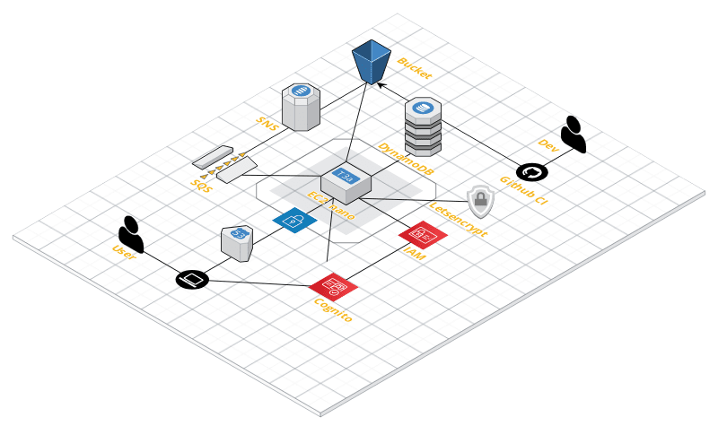

[](https://github.com/tillkuhn/angkor/releases)
[](https://github.com/tillkuhn/angkor/blob/master/LICENSE)

## AngKoR - Angular Kotlin RESTful Webapp Stack


This (almost) purely educational application manages places I'd like to visit some day. 
Key technologies: [Angular](https://angular.io/) based single-page app with Mapbox GL, AWS Cognito for OAuth2, S3 and PostgreSQL DB for persistence and
a Spring Boot backend written in [Kotlin](https://kotlinlang.org/), 
all created on AWS Infrastructure with [Terraform](https://www.terraform.io/) and Confidence.

## Infrastructure

You should have [AWS CLI](http://docs.aws.amazon.com/cli/latest/userguide/installing.html) and most importantly [Terraform](https://www.terraform.io/intro/getting-started/install.html) installed.
In a nutshell the application's neighborhood looks as follows (credits to [cloudcraft.co](https://cloudcraft.co/) for their nice web based drawing tool):



## Build locally

We use good old [GNU Make](https://www.gnu.org/software/make/) utility to manage all tasks for terraform, gradle, yarn
and whatever else we have in our ecosystem centrally. Rund without args to see what's possible, open the [Makefile](./Makefile) to look beyond!

```shell script
$ make
tfinit                         runs terraform init
tfplan                         runs terraform plan with implicit init and fmt (alias: plan)
tfapply                        runs terraform apply with auto-approval (alias: apply)
ec2stop                        stops the ec2 instance (alias: stop)
ec2start                       launches the ec-2instamce (alias: start)
ec2status                      get ec2 instance status (alias: status)
ec2login                       ssh logs into current instance (alias: ssh)
ec2pull                        pulls recent config and changes on server side, triggers docker-compose up (alias: pull)
apiclean                       cleans up build/ folder in api
apibuild                       assembles backend jar with gradle (alias: assemble)
apirun                         runs springBoot app using gradle bootRun (alias: bootrun)
apideploy                      build api docker image and deploys to dockerhub
uiclean                        cleans up dist/ folder in ui
uibuild                        builds ui --prod
uirun                          runs ui with ng serve and opens browser (alias: serve)
uimock                         runs mockapi server for frontend
uideploy                       build ui docker image and deploys to dockerhub
allclean                       Clean up build artifact directories in backend and frontend (alias: clean)
allbuild                       Builds frontend and backend (alias: build)
alldeploy                      builds and deploys frontend and backend images (alias deploy)
```

## Does it work?

```shell script
$ curl  http:/localhost:8080/greeting?name=horst
   {"id":2,"content":"Hello, horst"}
$ open http://localhost:4200
```

## Inspiration and further readings (totally unsorted, potentially outdated)

* Initialy forked from [Creating a RESTful Web Service with Spring Boot](https://kotlinlang.org/docs/tutorials/spring-boot-restful.html) Source [Github](https://github.com/Kotlin/kotlin-examples/tree/master/tutorials/spring-boot-restful)
* [Let's encrypt](https://dzone.com/articles/spring-boot-secured-by-lets-encrypt)
* [DynamoDB with Kotlin and Spring Boot (Part 1)](https://tuhrig.de/dynamodb-with-kotlin-and-spring-boot/)
* [EC2](https://calculator.s3.amazonaws.com/index.html) vs [Fargate](https://aws.amazon.com/de/fargate/pricing/) Pricing
* [terraform-aws-docker](https://github.com/salizzar/terraform-aws-docker/blob/master/main.tf)
* [Authenticating with Amazon Cognito Using Spring Security](https://www.baeldung.com/spring-security-oauth-cognito)
* [Spring Boot bootstrapping class and populate the database with a few User entities](https://www.baeldung.com/spring-boot-angular-web)
* [terraform-tips-tricks-loops-if-statements-and-gotchas](https://blog.gruntwork.io/terraform-tips-tricks-loops-if-statements-and-gotchas-f739bbae55f9)
* [Using the Let’s Encrypt Certbot to get HTTPS on your Amazon EC2 NGINX box](https://www.freecodecamp.org/news/going-https-on-amazon-ec2-ubuntu-14-04-with-lets-encrypt-certbot-on-nginx-696770649e76/)
* [fix cerbot install issue on amazon linux 2](https://medium.com/@andrenakkurt/great-guide-thanks-for-putting-this-together-gifford-nowland-c3ce0ea2455)
* [Official aws ertificate Automation: Let's Encrypt with Certbot on Amazon Linux 2](https://docs.aws.amazon.com/AWSEC2/latest/UserGuide/SSL-on-amazon-linux-2.html#letsencrypt)
* [Terraform via makefile](https://github.com/pgporada/terraform-makefile)
* [nginx auto reload config script](https://github.com/kubernetes/examples/blob/master/staging/https-nginx/auto-reload-nginx.sh)
* [Uploading a file to a bucket with terraform or delegate to aws cli or user archive_file](https://stackoverflow.com/questions/57456167/uploading-multiple-files-in-aws-s3-from-terraform) an d [use an AWS Lambda function to retrieve an object from S3, unzip it, then upload content back up again](https://stackoverflow.com/questions/51276201/how-to-extract-files-in-s3-on-the-fly-with-boto3)
* [Angular 8 Tutorial: Learn to Build Angular 8 CRUD Web App products](https://www.djamware.com/post/5d0eda6f80aca754f7a9d1f5/angular-8-tutorial-learn-to-build-angular-8-crud-web-app)
* [Intergration test dydb](https://www.baeldung.com/spring-data-dynamodb)
* [export-data-from-dynamodb](https://stackoverflow.com/questions/18896329/export-data-from-dynamodb)
* https://docs.spring.io/spring-boot/docs/current/reference/html/deployment.html
* https://blog.codecentric.de/en/2019/05/aws-cloud-hosted-application-part-1/
* https://www.hiveit.co.uk/labs/terraform-aws-vpc-example/terraform-aws-vpc-tutorial-5-prepare-a-web-application-for-ec2
* https://github.com/benoutram/terraform-aws-vpc-example/tree/Lab-5-Prepare-a-web-application-for-ec2
* https://medium.com/@saurabh6790/generate-wildcard-ssl-certificate-using-lets-encrypt-certbot-273e432794d7
