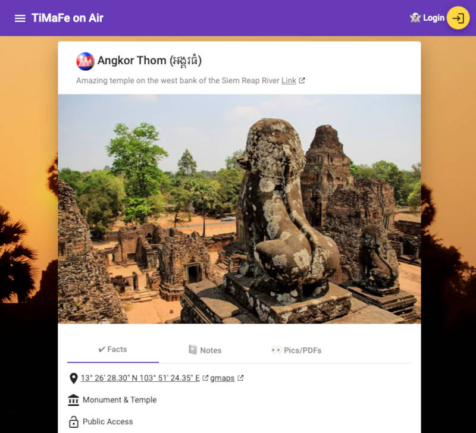
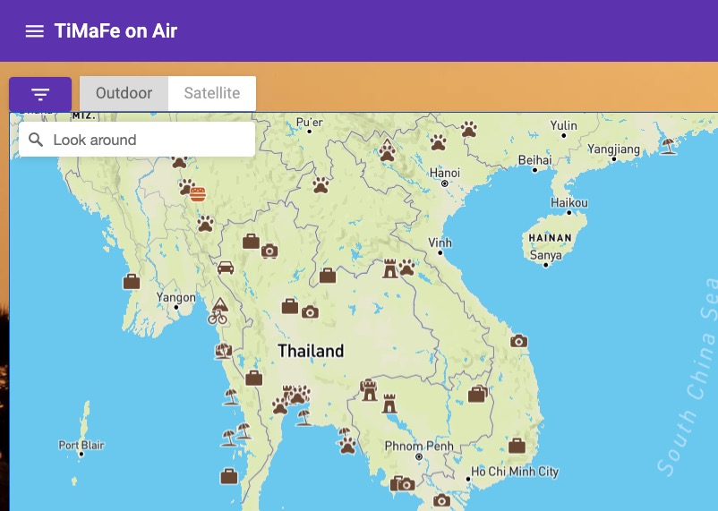
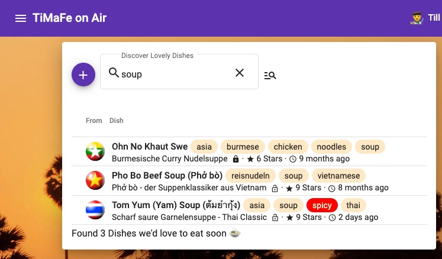

[](https://github.com/tillkuhn/angkor/releases)

[](https://github.com/tillkuhn/angkor/blob/master/LICENSE)
[](https://sonarcloud.io/dashboard?id=angkor-api)

 
[](https://goreportcard.com/report/github.com/tillkuhn/angkor)

[//]: # (COOL: dynamic TOML Badge https://shields.io/badges/dynamic-toml-badge)


[//]: # ( https://img.shields.io/keybase/pgp/tillkuhn )
[//]: # (check https://github.com/Naereen/badges and https://github.com/Ileriayo/markdown-badges for more interesting badges)

## Project "Angkor" - Angular Golang Kotlin RESTful Webapp Stack


This (almost) purely educational app manages places I'd like to visit some day, and helps me to keep track of more or less exotic dishe recipes.  

Key technologies: [Angular](https://angular.io/) based single-page app with [Mapbox GL](https://docs.mapbox.com/mapbox-gl-js/api/), [AWS Cognito](https://aws.amazon.com/cognito/) for OAuth2, [PostgreSQL](https://www.postgresql.org/) DB and [S3](https://aws.amazon.com/s3/) for persistence and a [Spring Boot](https://spring.io/projects/spring-boot) backend written in [Kotlin](https://kotlinlang.org/), various spin-off tools written in [Golang](https://golang.org/), all provisioned to AWS Infrastructure with [Terraform](https://www.terraform.io/) and lots of Confidence.

## tl;dr

```shell script
$ make angkor
🌇 Successfully Built Angkor 
```

## Modules

Angkor is a *monorepo* which combines the following modules and technologies:

| Path   | Descriptions                         | Technologies / Tools / Language(s)                                                    | Build Status                                                                          |
|--------|--------------------------------------|---------------------------------------------------------------------|---------------------------------------------------------------------------------------|
| `/terraform` | Cloud Infrastructure as Code         |    |  |
| `/kotlin`   | Server Backend                       |  ,                                            |        |
| `/angular`    | Frontend and reverse proxy           |      |      |
| `/go` | Supporting services written in Go |   |        |
| `/docs`  | Project Documentation                | [Antora](https://antora.org/), [AsciiDoc](https://asciidoc-py.github.io/)                             |        | 

## Components & Infrastructure

You should have [AWS CLI](http://docs.aws.amazon.com/cli/latest/userguide/installing.html) and most importantly [Terraform](https://www.terraform.io/intro/getting-started/install.html) installed.
In a nutshell the application's neighborhood looks as follows: 


## Impressions

### Places to Go (Details)


### WorldWideMap (Overview)


### Wish a Dish (Search)


## Angkor wasn't built in a day ...

This project uses the good old [GNU Make](https://www.gnu.org/software/make/) utility to manage all tasks for terraform, gradle, yarn and whatever else we have in our ecosystem. Run `make` without args to see what's possible, open the [Makefile](./Makefile) to look beyond!

```shell script
$ make

  █████╗ ███╗   ██╗ ██████╗ ██╗  ██╗ ██████╗ ██████╗
 ██╔══██╗████╗  ██║██╔════╝ ██║ ██╔╝██╔═══██╗██╔══██╗
 ███████║██╔██╗ ██║██║  ███╗█████╔╝ ██║   ██║██████╔╝
 ██╔══██║██║╚██╗██║██║   ██║██╔═██╗ ██║   ██║██╔══██╗
 ██║  ██║██║ ╚████║╚██████╔╝██║  ██╗╚██████╔╝██║  ██║
 ╚═╝  ╚═╝╚═╝  ╚═══╝ ╚═════╝ ╚═╝  ╚═╝ ╚═════╝ ╚═╝  ╚═╝

Available Commands:
  api-clean            Cleans up ./kotlin/build folder
  api-build            Assembles backend jar in ./api/build with gradle (alias: assemble)
  api-test             Runs spring boot unit and integration tests in ./kotlin
  api-run              Runs springBoot API in ./kotlin using gradle bootRun (alias: bootrun)
  api-mock             Runs OIDC (and potentially other) mock service for api

  ui-build             Run ng build  in ./ui
  ui-build-prod        Run ng build --prod in ./ui
  ui-test              Runs chromeHeadless tests in ./angular
  ui-run               Run angular with ng serve and opens WebUI in browser (alias: serve,open,angular)
  ui-mocks             Run json-server on foreground to mock API services for UI (alias: mock)

  tf-init              Runs terraform init on working directory ./terraform, switch to
  tf-plan              Runs terraform plan with implicit init and fmt (alias: plan)
  tf-apply             Runs terraform apply with auto-approval (alias: apply)


  docs-clean           Cleanup docs build directory
  docs-build           Generate documentation site using antora-playbook.yml
  docs-push            Generate documentation site and push to s3
  docs-deploy          Deploys docs with subsequent pull and restart of server on EC2 (alias: docs)


  all-clean            Clean up build artifact directories in backend and frontend (alias: clean)
  all-build            Builds frontend and backend (alias: build)
  all-test             Builds frontend and backend (alias: build)
  all-deploy           builds and deploys frontend and backend images (alias deploy)

  angular-clean        Remove angular dist folder ./angular/dist
  angkor               The ultimate target - builds and deploys everything 🦄

  release              create final release tag with semtag

  git-clean            git cleanup, e.g. delete up stale git branches
```

## I want more Documentation

Seriously? Check our Dedicated **[angkor-docs](https://dev.timafe.net/angkor-docs/angkor-docs/)**  project built with [Antora](https://antora.org/)


## Contribute

See [CONTRIBUTING.md](./CONTRIBUTING.md)
